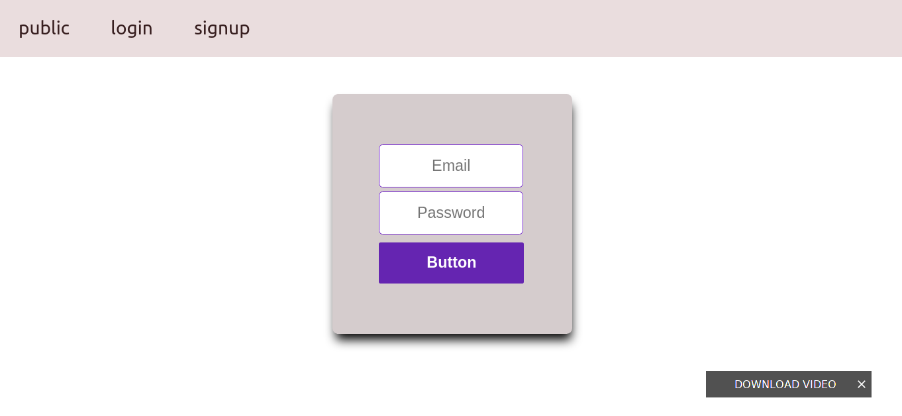

# create simple web site

### front 
- useing react, react router, universal-cookie, hooks, async, await.

### backend 
- using node, express, express router, pg postgres database, jsonwebtoken, @hapi/joi to hash password.